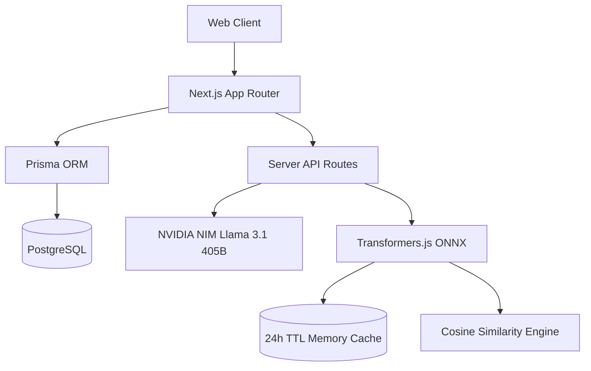
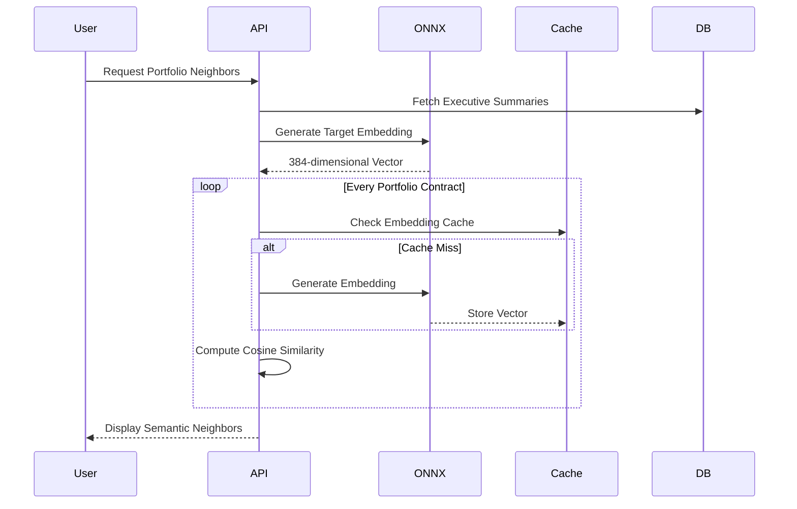

# System Architecture & ML Pipeline

## High-Level Architecture

```mermaid
graph TD
    Client[Web Client] --> NextJS[Next.js App Router]
    NextJS --> Prisma[Prisma ORM]
    Prisma --> PG[(PostgreSQL)]
    
    NextJS --> API[Server API Routes]
    API --> NIM[NVIDIA NIM Llama 3.1 405B]
    API --> MiniLM[Transformers.js ONNX]
    
    MiniLM --> Cache[(24h TTL Memory Cache)]
    MiniLM --> Sim[Cosine Similarity Engine]
```

## Machine Learning Pipeline (Semantic Portfolio)

```mermaid
sequenceDiagram
    participant User
    participant API
    participant ONNX
    participant Cache
    participant DB

    User->>API: Request Portfolio Neighbors
    API->>DB: Fetch Executive Summaries
    API->>ONNX: Generate Target Embedding
    ONNX-->>API: 384-dimensional Vector
    
    loop Every Portfolio Contract
        API->>Cache: Check Embedding Cache
        alt Cache Miss
            API->>ONNX: Generate Embedding
            ONNX-->>Cache: Store Vector
        end
        API->>API: Compute Cosine Similarity
    end
    
    API-->>User: Display Semantic Neighbors
```
