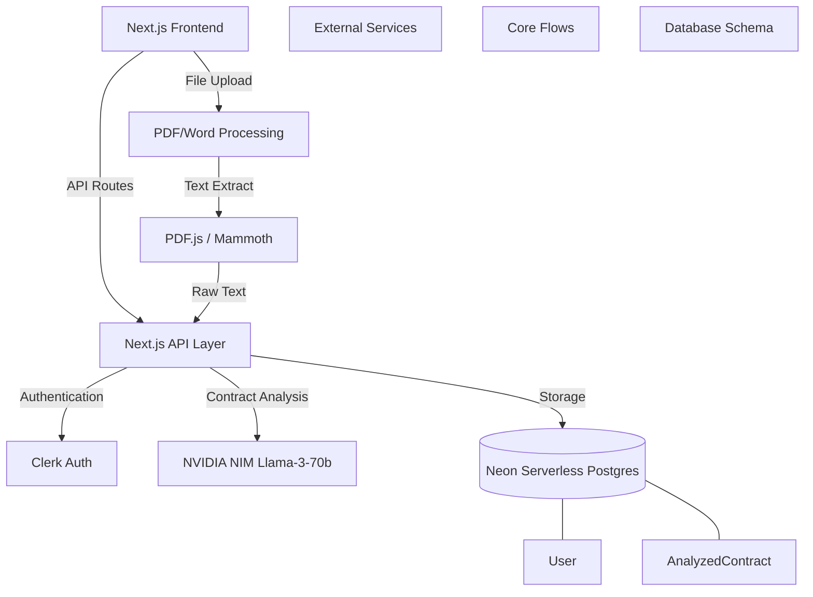

# BeforeYouSign - Major Project Viva Preparation

This document contains everything you need to prepare for your final year project presentation and viva voce.

## 1. System Architecture

## 2. Key Technical Decisions (Why did you choose X?)

**Q: Why Next.js instead of React + Node.js?**
A: Next.js allows us to have a unified repository (monorepo). It handles both the React frontend and the backend API routes seamlessly. This reduces deployment complexity and latency since the API and frontend run in the same environment.

**Q: Why Neon Serverless Postgres instead of MongoDB?**
A: Contract data has strong relational properties (User -> Contracts -> Analysis). Postgres provides ACID compliance which is critical for legal tech. Neon's serverless architecture allows the database to scale to zero when not in use, saving costs, and spin up instantly when a user uploads a contract.

**Q: Why NVIDIA NIM over OpenAI?**
A: NVIDIA NIM allows us to use open-source enterprise models (like Llama 3) with extremely high throughput and low latency. It is also more cost-effective for large token contexts (like full legal contracts) compared to GPT-4.

**Q: How do you handle large contracts exceeding token limits?**
A: We implemented a chunking and truncation strategy. If a contract exceeds `maxPromptChars`, we safely truncate it and append a notice `[Contract text truncated for faster analysis due to deployment limits]` to prevent API failure.

**Q: How is User Authentication handled?**
A: We use Clerk for authentication. It provides enterprise-grade security out of the box (MFA, social logins, session management) without us needing to manage passwords or JWTs manually.

## 3. Top 10 Viva Questions & Answers

### General Product
1. **Q: What problem does BeforeYouSign solve?**
   **A:** It democratizes legal intelligence. Most people sign contracts (employment, rental, freelance) without understanding the risks because lawyers are expensive. Our platform instantly flags dangerous clauses, explains them in plain English, and provides negotiation strategies.

2. **Q: Is this legally binding or a replacement for a lawyer?**
   **A:** No. We display a clear disclaimer that this is an AI tool for informational purposes. It acts as a "first pass" filter to help users identify red flags before they decide if they need to hire a lawyer.

### Architecture & Backend
3. **Q: How does the AI analysis actually work under the hood?**
   **A:** When a PDF is uploaded, the frontend extracts the text using `pdf.js`. This text is sent to our Next.js API, which constructs a highly-specific structured prompt containing the jurisdiction and instructions. This is sent to NVIDIA NIM. The AI returns a strict JSON payload containing the risk score, red flags, and clause breakdown.

4. **Q: How do you ensure the AI returns valid JSON every time?**
   **A:** We use strict prompt engineering requesting "ONLY this JSON, no markdown". Additionally, we implemented a robust `parseJsonResponse` utility that strips out markdown code blocks (like \`\`\`json) and handles trailing commas before passing it to `JSON.parse()`.

5. **Q: What happens if the database goes down?**
   **A:** We designed the system to degrade gracefully. If the database is unreachable, the AI analysis still works entirely in memory. The user can still analyze their document, chat with it, and export the results to PDF/DOCX. Only the history/dashboard saving feature will fail, but the core product remains functional.

### Advanced Features
6. **Q: How does the "Contract Chat" feature work?**
   **A:** We use the same NVIDIA NIM API, but we maintain a short-term conversation history. We pass the current document context along with the user's question, allowing the AI to answer specifically based on the uploaded contract rather than generic legal knowledge.

7. **Q: How does the "Compare Versions" feature work?**
   **A:** We generate an analysis for the second document, and then run a programmatic diff (`compareContracts` utility) between the two JSON risk snapshots. We compare `riskScore` deltas, added/removed red flags, and track which clauses became riskier or safer.

8. **Q: How is the analysis data saved?**
   **A:** Once analysis is complete, the frontend sends the full JSON result to the `/api/drafting` endpoint, which serializes the entire JSON into the `summary` column of the `AnalyzedContract` Postgres table. This acts as an immutable snapshot.

9. **Q: Why use DOCX instead of just HTML?**
   **A:** Initially we used HTML saved with a `.doc` extension. However, this causes compatibility warnings in Microsoft Word. We upgraded to the `docx` npm library to generate true binary Word documents, which is essential for professional legal environments.

10. **Q: What was the biggest technical challenge?**
    **A:** Handling rate limits and API timeouts. Legal documents are huge, and the AI takes time to process them. We solved this by implementing exponential backoff retries in `ContractAnalyzer`, and providing the user with real-time progress indicators on the frontend.

## 4. Presentation Flow (Demo Script)

**Slide 1: Introduction**
- "Welcome to BeforeYouSign, an AI-powered legal intelligence platform."
- Problem: People sign bad contracts. Lawyers are expensive.
- Solution: Instant AI risk analysis.

**Slide 2: Architecture**
- Show the Mermaid diagram.
- Highlight Next.js, Clerk Auth, Neon DB, and NVIDIA NIM.

**Slide 3: Live Demo**
1. **Upload:** Upload a sample NDA or Employment contract.
2. **Analysis:** Show the Executive Briefing and the Risk Score (e.g., 65/100).
3. **Red Flags:** Show how the system caught the "Non-Compete" or "Unlimited Liability" clause.
4. **Chat:** Open the chat and ask "Can I get fired without cause according to this?"
5. **Export:** Export the report to a true DOCX file and open it.
6. **Dashboard:** Go to the dashboard to show the historical risk trends and saved contracts.

**Slide 4: Future Scope**
- Lawyer Marketplace Integration (connect with real lawyers if risk is too high).
- Multi-party digital signatures.
- OCR for scanned physical documents.

## 5. Potential Weaknesses to Defend

- **Weakness:** "AI hallucinations in legal advice."
  - **Defense:** "We mitigate this by strictly constraining the prompt to only analyze the provided text, and by explicitly warning the user that this is not legal advice."
- **Weakness:** "What if the contract is 200 pages long?"
  - **Defense:** "Currently, we truncate to the maximum context window of the model. In a commercial V2, we would implement RAG (Retrieval-Augmented Generation) with a vector database like Pinecone to chunk and search the document."
