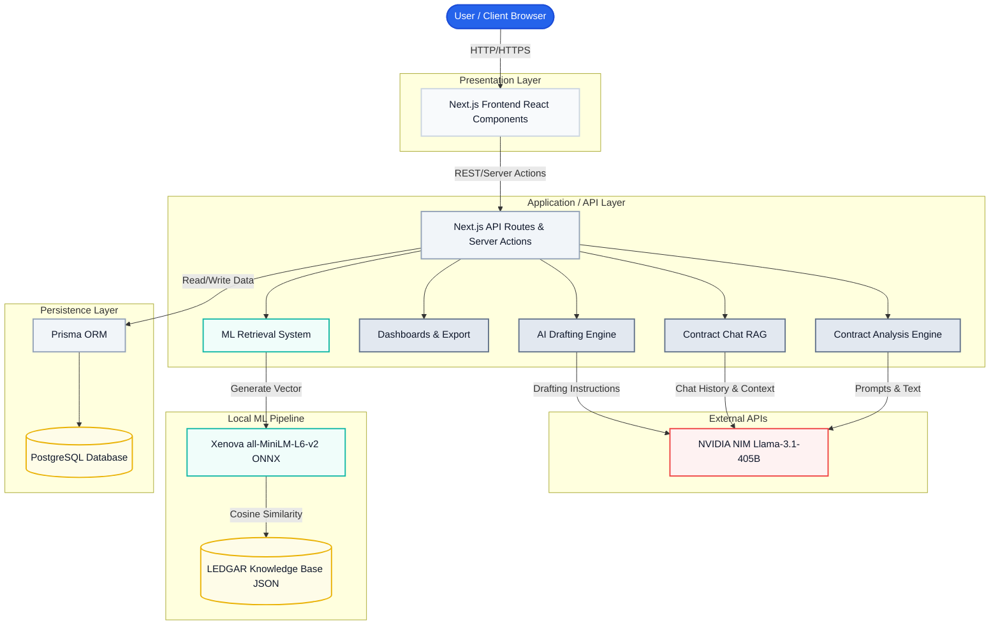

# System Architecture Diagram

This diagram maps out the core flows, modules, and external dependencies of BeforeYouSign. You can export this code to include in your PPT or academic report.

```mermaid
flowchart TD
    %% Define Styles
    classDef user fill:#2563eb,stroke:#1d4ed8,stroke-width:2px,color:#fff
    classDef frontend fill:#f8fafc,stroke:#cbd5e1,stroke-width:2px,color:#0f172a
    classDef api fill:#f1f5f9,stroke:#94a3b8,stroke-width:2px,color:#0f172a
    classDef module fill:#e2e8f0,stroke:#64748b,stroke-width:2px,color:#0f172a
    classDef ml fill:#f0fdfa,stroke:#14b8a6,stroke-width:2px,color:#0f172a
    classDef db fill:#fefce8,stroke:#eab308,stroke-width:2px,color:#0f172a
    classDef external fill:#fef2f2,stroke:#ef4444,stroke-width:2px,color:#0f172a

    %% Nodes
    User([User / Client Browser]):::user
    
    subgraph Frontend [Presentation Layer]
        NextJS[Next.js Frontend React Components]:::frontend
    end
    
    subgraph Backend [Application / API Layer]
        API[Next.js API Routes & Server Actions]:::api
        
        %% Core Modules
        CA[Contract Analysis Engine]:::module
        CC[Contract Chat RAG]:::module
        CD[AI Drafting Engine]:::module
        DB[Dashboards & Export]:::module
        MLR[ML Retrieval System]:::ml
    end
    
    subgraph MachineLearning [Local ML Pipeline]
        Embeddings[Xenova all-MiniLM-L6-v2 ONNX]:::ml
        KB[(LEDGAR Knowledge Base JSON)]:::db
    end
    
    subgraph Data [Persistence Layer]
        ORM[Prisma ORM]:::api
        Postgres[(PostgreSQL Database)]:::db
    end
    
    subgraph External [External APIs]
        NVIDIA[NVIDIA NIM Llama-3.1-405B]:::external
    end

    %% Relationships
    User -->|HTTP/HTTPS| NextJS
    NextJS -->|REST/Server Actions| API
    
    %% API Routing
    API --> CA
    API --> CC
    API --> CD
    API --> DB
    API --> MLR
    
    %% ML Flow
    MLR -->|Generate Vector| Embeddings
    Embeddings -->|Cosine Similarity| KB
    
    %% External AI Flow
    CA -->|Prompts & Text| NVIDIA
    CC -->|Chat History & Context| NVIDIA
    CD -->|Drafting Instructions| NVIDIA
    
    %% Database Flow
    API -->|Read/Write Data| ORM
    ORM --> Postgres
```
