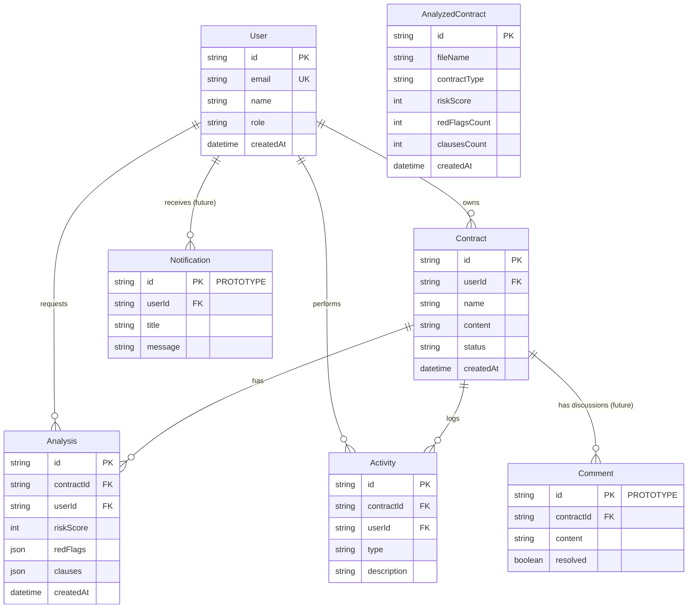

# Entity Relationship (ER) Diagram

This diagram displays the active core database tables powering the application, intentionally filtering out unused tables to accurately reflect the live system boundaries.

