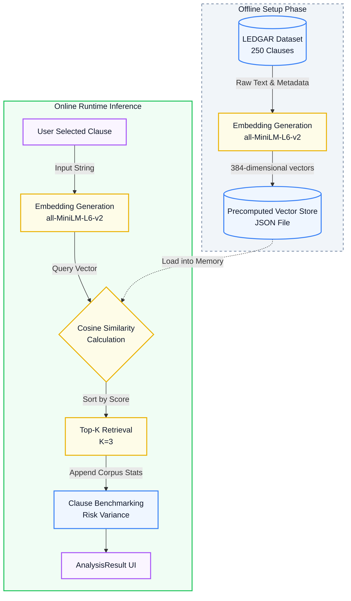

# ML Pipeline Diagram

This diagram visualizes your exact semantic retrieval engine architecture, highlighting the separation between the offline dataset generation and the online inference process.

