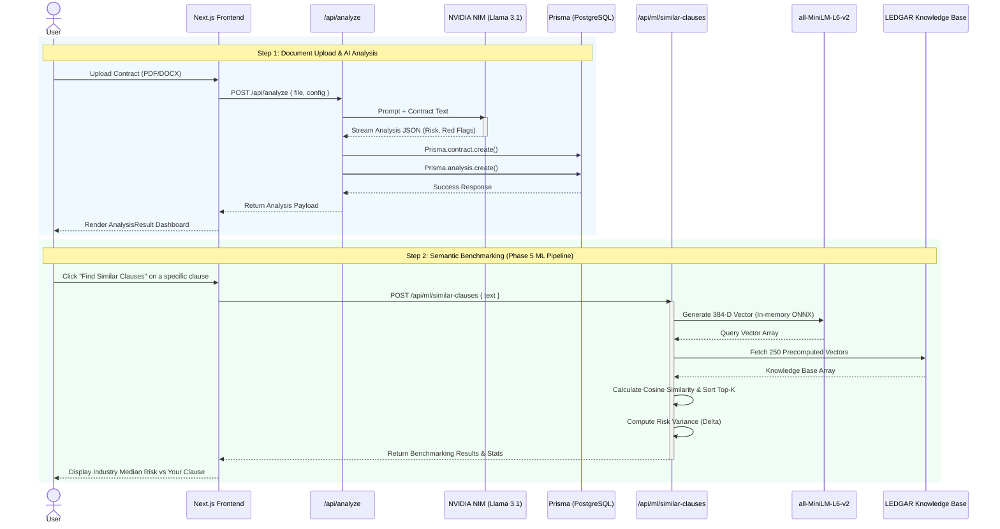

# Sequence Diagram

This sequence diagram illustrates the core "Happy Path" demo flow: uploading a contract, analyzing it with NVIDIA NIM, and comparing clauses using local ML embeddings.

```mermaid
sequenceDiagram
    actor User
    participant UI as Next.js Frontend
    participant API as /api/analyze
    participant NVIDIA as NVIDIA NIM (Llama 3.1)
    participant DB as Prisma (PostgreSQL)
    participant ML as /api/ml/similar-clauses
    participant Embed as all-MiniLM-L6-v2
    participant LEDGAR as LEDGAR Knowledge Base

    %% Phase 1: Contract Analysis
    rect rgb(240, 249, 255)
        Note over User, DB: Step 1: Document Upload & AI Analysis
        User->>UI: Upload Contract (PDF/DOCX)
        UI->>API: POST /api/analyze { file, config }
        
        API->>NVIDIA: Prompt + Contract Text
        activate NVIDIA
        NVIDIA-->>API: Stream Analysis JSON (Risk, Red Flags)
        deactivate NVIDIA
        
        API->>DB: Prisma.contract.create()
        API->>DB: Prisma.analysis.create()
        DB-->>API: Success Response
        
        API-->>UI: Return Analysis Payload
        UI-->>User: Render AnalysisResult Dashboard
    end

    %% Phase 2: Semantic Clause Benchmarking
    rect rgb(240, 253, 244)
        Note over User, LEDGAR: Step 2: Semantic Benchmarking (Phase 5 ML Pipeline)
        User->>UI: Click "Find Similar Clauses" on a specific clause
        UI->>ML: POST /api/ml/similar-clauses { text }
        
        activate ML
        ML->>Embed: Generate 384-D Vector (In-memory ONNX)
        Embed-->>ML: Query Vector Array
        
        ML->>LEDGAR: Fetch 250 Precomputed Vectors
        LEDGAR-->>ML: Knowledge Base Array
        
        ML->>ML: Calculate Cosine Similarity & Sort Top-K
        ML->>ML: Compute Risk Variance (Delta)
        ML-->>UI: Return Benchmarking Results & Stats
        deactivate ML
        
        UI-->>User: Display Industry Median Risk vs Your Clause
    end
```
