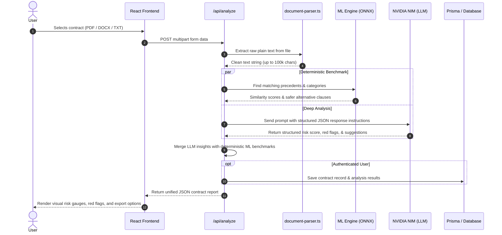

# System Architecture

This document describes the high-level system architecture of **BeforeYouSign**, detailing how data flows from user uploads through document parsing, vector indexing, generative AI reasoning, and persistent storage.

---

## 1. High-Level System Overview

BeforeYouSign is built as a unified **Next.js 16** application using the App Router. The platform combines a client-side React 19 interface with serverless Node.js backend routes, local vector search, and external LLM inference.

```
┌─────────────────────────────────────────────────────────────────┐
│                      Client Layer (Browser)                     │
│  - Next.js 16 / React 19 UI (Tailwind CSS v4)                   │
│  - Client-side PDF Engine (pdf-lib / Wasm)                      │
│  - Chrome Browser Extension (Manifest V3 DOM Inserter)          │
└────────────────┬────────────────────────────────────────────────┘
                 │ HTTP / REST API
┌────────────────▼────────────────────────────────────────────────┐
│               Serverless Application Layer (Node.js)            │
│  - Route Handlers (`app/api/*`)                                 │
│  - File Parser (`lib/document-parser.ts` - PDF, DOCX, TXT)      │
│  - Authentication Guards (Clerk / NextAuth)                     │
└──────────────┬──────────────────────────────────┬───────────────┘
               │                                  │
┌──────────────▼────────────────┐ ┌───────────────▼───────────────┐
│     Edge ML & Vector Tier     │ │     Generative AI Tier        │
│  - Transformers.js (ONNX)     │ │  - NVIDIA NIM Client (OpenAI) │
│  - `all-MiniLM-L6-v2` (384-d) │ │  - Primary: Llama 3.3 70B     │
│  - LEDGAR Precedents Dataset  │ │  - Fast/Analysis: Llama 3.1 8B│
│  - In-Memory Query Cache      │ │  - Fallback: Google Gemini    │
└──────────────┬────────────────┘ └───────────────┬───────────────┘
               │                                  │
┌──────────────▼──────────────────────────────────▼───────────────┐
│                    Persistence & Storage Tier                   │
│  - PostgreSQL Database (via Prisma ORM)                         │
│  - Supabase Storage (contract file attachments & user avatars)  │
└─────────────────────────────────────────────────────────────────┘
```

---

## 2. The Dual-Pipeline AI Strategy

Legal tech applications often struggle with two problems when relying solely on external LLMs:
1. **High Latency & Costs:** Sending entire 50-page contracts repeatedly to large cloud models incurs heavy costs and response delays.
2. **Hallucination in Benchmarks:** Asking an LLM *"What is the standard market risk for this clause?"* can produce subjective or fluctuating answers.

To resolve this, BeforeYouSign separates tasks into two distinct pipelines:

### Pipeline A: Deterministic Vector Search (Local Edge ML)
- **Library:** `@xenova/transformers` (running in Node.js via ONNX runtime).
- **Model:** `Xenova/all-MiniLM-L6-v2` (quantized 384-dimensional feature extraction).
- **Data Source:** `data/legal-precedents.json` (thousands of standard clauses extracted from SEC-filed agreements in the open LEDGAR dataset) and precomputed embeddings `data/legal-precedents-embeddings.json`.
- **Purpose:** 
  - Computes cosine similarity between user clauses and standard market precedents.
  - Predicts clause category using k-NN majority voting.
  - Finds safer precedent alternatives with lower historical risk benchmarks.
  - Generates an **Estimated Risk Reduction (ERR)** metric mathematically, without prompt ambiguity.

### Pipeline B: Generative Reasoning & Redlining (Cloud LLM)
- **Client:** `lib/nvidia-client.ts` using the OpenAI-compatible REST API at `https://integrate.api.nvidia.com/v1`.
- **Active Models:**
  - `meta/llama-3.3-70b-instruct` (high reasoning tasks: live negotiation, complex drafting, playbook synthesis).
  - `meta/llama-3.1-8b-instruct` (fast turnaround tasks: rapid contract scoring and initial clause extraction).
- **Fallback Integration:** Google Gemini API (`@google/generative-ai`) configured for graceful redundancy if the primary provider experiences rate limits.
- **Purpose:**
  - Extracts key contract metadata (parties, governing law, effective dates).
  - Flags predatory language, ambiguous phrasing, and unfair indemnification terms.
  - Produces plain-language explanations and counter-clauses.

---

## 3. End-to-End Analysis Request Lifecycle

Here is what happens when a user uploads a document on `/analyze`:



---

## 4. Key Architectural Modules

### 4.1 Document Parsing (`lib/document-parser.ts`)
- **PDF Documents:** Extracted using `pdf-parse`. Text blocks are cleaned to remove duplicate page headers and excessive line feeds.
- **DOCX Documents:** Extracted using `mammoth.extractRawText`, preserving paragraph structures without markup pollution.
- **Plain Text / Markdown:** Sanitized and validated directly.
- **Size Bounds:** Configured via `NEXT_PUBLIC_MAX_FILE_SIZE` (default: 10MB) and `ANALYZE_MAX_PROMPT_CHARS` (default: 100,000 characters).

### 4.2 LLM Client & Prompt Engineering (`lib/nvidia-client.ts`, `lib/contract-analyzer.ts`)
- Prompts instruct the model to return strictly valid JSON matching TypeScript interfaces defined in `lib/types.ts`.
- The parser (`parseJsonResponse`) handles potential markdown backtick fences (` ```json ... ``` `) and sanitizes raw model outputs before passing to the UI.
- Built-in exponential backoff handles HTTP 429 (Rate Limit) and 503 (Service Unavailable) responses.

### 4.3 Database Schema (`prisma/schema.prisma`)
The system tracks the following entities via Prisma:
- **User:** User account information, subscription tier, and profile preferences.
- **Contract:** Uploaded agreements, original text, file URL, status, and associated risks.
- **Analysis:** Detailed analysis record with overall score, summary, and metadata.
- **Clause:** Individual extracted clauses, their detected category, risk rating (low, medium, high, critical), and recommendations.
- **AuditLog:** Timestamped security audit records for compliance and non-repudiation.
- **Workflow:** Lifecycle stages (draft, review, signed, active, expired) and renewal tracking.

### 4.4 Client-Side PDF Engine (`lib/pdf-engine/`)
To prevent unnecessary server bandwidth and preserve confidential agreements, operations on the `/tools` page (merge, split, rotate, image conversion) execute client-side via `pdf-lib` and Canvas API. An optional server-side fallback is available in `app/api/pdf/*` for headless workflows.

---

## 5. Security & Privacy Guarantees

1. **Transient Processing:** By default, contract text passed to the `/api/analyze` endpoint is processed in memory and not permanently retained unless an authenticated user explicitly saves the contract to their account repository.
2. **API Secret Isolation:** No API keys (NVIDIA, Google, Supabase service roles) are bundled into client-side JavaScript. All third-party calls route through protected Next.js server route handlers.
3. **Cryptographic Validation:** Documents processed for e-signature are hashed client-side with SHA-256 to ensure data integrity during review.
