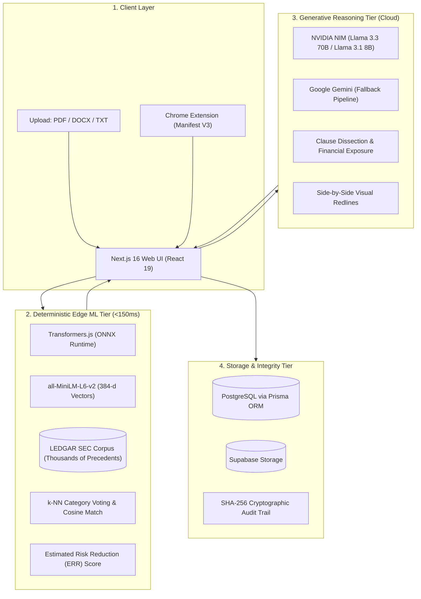

# ⚖️ BeforeYouSign
## The Intelligent Legal Operating System
**AI Contract Analysis • Semantic Risk Benchmarking • Automated Redlining**

**Presenter:** Srinivas Jangiti  
**Live Application:** [beforeyousign.vercel.app](https://beforeyousign.vercel.app)  
**Tech Stack:** Next.js 16 • React 19 • NVIDIA NIM • ONNX Transformers • Prisma • PostgreSQL

<!-- Speaker Notes:
Good morning/afternoon everyone. Today I'm presenting BeforeYouSign, an intelligent legal operating system built to democratize contract comprehension. Before you sign any contract—whether it's an employment offer, a SaaS agreement, or a commercial lease—this platform gives you instant, unbiased, and mathematically backed legal analysis.
-->

---

# 🚨 The Problem: Legal Asymmetry

### Contracts are designed to protect the drafter, not the signer.

- **Intentionally Opaque Legalese:** Complex clauses bury unilateral liability, perpetual non-competes, and predatory auto-renewals in fine print.
- **Prohibitive Cost of Counsel:** Legal review costs **$300–$800/hour**, leaving freelancers, consumers, and early-stage founders vulnerable.
- **Asymmetric Information:** Large enterprises have dedicated legal departments; signers often sign blindly out of necessity.
- **Post-Signing Liabilities:** 40% of contract disputes arise from missed renewal deadlines, vague cure periods, or uncapped indemnification traps.

<!-- Speaker Notes:
The core problem we're solving is asymmetry. Large companies have teams of lawyers drafting 40-page agreements, while small businesses and individuals cannot afford hundreds of dollars an hour just to review a standard vendor contract. Most people either sign blindly or spend days trying to decipher legalese.
-->

---

# 💡 The Solution: BeforeYouSign

### A Dual-Pipeline Platform That Makes Contracts Transparent

1. **Deterministic Risk Benchmarking:**  
   Local, fast vector embeddings match contract clauses against thousands of real SEC-filed agreements from the **LEDGAR corpus** to provide empirical, mathematical risk baselines.
2. **Generative Legal Intelligence:**  
   Large language models (Llama 3.3 70B & Llama 3.1 8B via NVIDIA NIM) identify fine-print red flags, calculate financial exposure, and draft balanced counter-proposals.
3. **In-Browser & Client-First Privacy:**  
   Grammarly-style Chrome extension for in-page contract inspection, plus zero-server-upload PDF manipulation tools.

<!-- Speaker Notes:
Our solution is BeforeYouSign. Instead of relying purely on a generic chatbot that might hallucinate or produce varying answers, we developed a dual-pipeline architecture. We combine deterministic, mathematical vector benchmarking with generative reasoning.
-->

---

# 🏛️ Dual-Pipeline System Architecture



<!-- Speaker Notes:
Here is the system architecture. Notice the clean separation between Tier 2—the local ONNX vector engine running in-process in under 150 milliseconds—and Tier 3—the cloud generative tier handling deep contextual analysis. This ensures fast response times, deterministic benchmarks, and zero model hallucinations during risk scoring.
-->

---

# 🧠 Edge Machine Learning: Empirical Benchmarks

### Moving Beyond LLM Hallucinations with the LEDGAR Corpus

- **Quantized ONNX Engine:** Uses `@xenova/transformers` running `all-MiniLM-L6-v2` directly on Node.js without Python dependencies.
- **384-Dimensional Embeddings:** Mean-pooled and L2-normalized dense sentence vectors.
- **Fast Dot-Product Cosine Similarity:**
  $$\text{Similarity}(A, B) = \sum_{i=1}^{384} A_i \cdot B_i$$
- **k-NN Category Classification:** Automatically classifies unlabelled clauses into legal categories (Indemnity, Termination, Governing Law) via top-K majority vote.
- **In-Memory Query Cache:** Bounded FIFO query cache (max 500 entries) eliminates redundant computation.

<!-- Speaker Notes:
One of the technical highlights of this project is our localized ML engine. We run Xenova's all-MiniLM-L6-v2 transformer model via ONNX. Because the vectors are L2-normalized, cosine similarity simplifies to a blazingly fast dot product that executes over thousands of precedent vectors in less than 5 milliseconds.
-->

---

# 📉 Estimated Risk Reduction (ERR)

### How We Quantify Safer Contract Language

```
[User's Contested Clause (e.g. Unilateral Indemnity)]
               │
               ▼  1. Extract 384-d Vector & Risk Score (e.g., Risk = 85)
               │
               ▼  2. Retrieve Top-20 Similar Clauses from SEC Filings
               │
               ▼  3. Filter: Only candidates with Benchmark Risk < 85
               │
               ▼  4. Rank: Highest Semantic Similarity + Lowest Risk
               │
[Safer Market Alternative Found (e.g. Mutual Indemnity, Risk = 30, Sim = 88%)]
```

### The Formula:
$$\text{ERR} = \text{Current Clause Risk} - \text{Recommended Precedent Risk} = 85 - 30 = \mathbf{55\text{ Points (64\% Safer)}}$$

<!-- Speaker Notes:
Instead of just telling a user 'this clause looks risky,' we give them an actionable, mathematical metric: Estimated Risk Reduction (ERR). We look up SEC precedents that match the original business meaning but feature fair, bilateral language, showing the user exactly how many risk points they save by adopting market-standard text.
-->

---

# ✨ Core Feature Showcase (1/3): Analysis & Redlines

### 1. AI Contract Risk Analyzer (`/analyze`)
- **Multi-Format Ingestion:** Instant parsing of `.pdf`, `.docx`, and `.txt` files up to 10MB.
- **0–100 Color-Coded Risk Score:** Critical 🔴, High 🟠, Medium 🟡, and Low 🟢 categories.
- **Financial Exposure Estimation:** Quantifies potential dollar penalties buried in fine print.
- **Export Formats:** Generate executive briefing reports in **PDF, DOCX, JSON, or Markdown**.

### 2. Side-by-Side Visual Redlining (`/negotiate`)
- Integrated `diff-match-patch` viewer showing line-by-line redline edits.
- Generates **Aggressive**, **Balanced**, and **Walk-Away** counter-proposals based on bargaining power.

<!-- Speaker Notes:
Let's look at the primary features. The Contract Analyzer takes a PDF, Word document, or raw text and generates a structured audit report within seconds. It highlights critical clauses, calculates financial exposure, and allows users to export the findings as a clean Word document or printable PDF.
-->

---

# ✨ Core Feature Showcase (2/3): Extension & PDF Suite

### 3. Chrome Extension: "Grammarly for Contracts"
- **Manifest V3 Architecture:** Lightweight background worker and in-page DOM scanner.
- **Wavy Underlines:** In-page colored underlines for risky clauses across any webpage or SaaS terms.
- **Interactive Tooltips:** Hover over any underlined text for an instant summary and counter-clause.
- **Shortcuts:** `Ctrl+Shift+B` to analyze current page, `Ctrl+Shift+H` to toggle highlights.

### 4. Zero-Server-Upload PDF Suite (`/tools`)
- **Client-Side Privacy:** Operations execute locally in the browser via `pdf-lib` and Canvas.
- **Full Utility Set:** Merge exhibits, split schedules, rotate scanned pages, and convert images to PDF without uploading files to third-party web tools.

<!-- Speaker Notes:
Another huge differentiator is our Chrome extension. It functions like Grammarly, but for legal risk. When you're reading a privacy policy or employment contract online, it places wavy red or orange underlines on tricky clauses with instant hover tooltips. And for file preparation, our PDF engine runs 100% client-side in the browser.
-->

---

# ✨ Core Feature Showcase (3/3): Governance & Lifecycle

### 5. Obligation Tracker & Renewal Calendar (`/obligations`, `/renewals`)
- Parses renewal deadlines, termination notice periods, and payment milestones.
- Proactive alerts at **30, 60, and 90 days** to avoid predatory auto-renewals.

### 6. Regulatory Compliance Scanner (`/compliance`)
- Automated compliance auditing against **GDPR, CCPA, HIPAA, and SOC 2** frameworks.

### 7. Cryptographic E-Signatures (`/esignature`, `/blockchain`)
- Digital signature canvas with **SHA-256 tamper-evident document hashing**.

### 8. Smart Template Builder & Clause Library (`/template-builder`, `/clauses`)
- Modular questionnaire that dynamically generates customized commercial agreements.

<!-- Speaker Notes:
Beyond analysis, BeforeYouSign is an end-to-end lifecycle platform. It extracts obligations into an interactive renewal calendar, scans for regulatory compliance like GDPR and HIPAA, includes an in-browser digital signature pad with SHA-256 document hashing, and provides a smart template builder.
-->

---

# 🛠️ Technology Stack Breakdown

| Tier | Technologies Used | Key Reason for Selection |
|---|---|---|
| **Frontend UI** | Next.js 16, React 19, Tailwind CSS v4 | Server components, fast rendering, modern responsive styling |
| **Icons & Charts**| Lucide React, Recharts | Interactive SVG risk gauges and portfolio analytics |
| **Generative AI**| NVIDIA NIM (Llama 3.3 70B & 3.1 8B) | Ultra-fast inference, high legal reasoning, OpenAI-compatible SDK |
| **Fallback AI**  | Google Gemini API (`@google/generative-ai`) | Redundant cloud pipeline during provider rate limits |
| **Local Vector ML**| `@xenova/transformers` (ONNX Runtime) | Zero-API-cost 384-d embeddings (`all-MiniLM-L6-v2`) in Node.js |
| **Doc Processing**| `pdf-lib`, `pdf-parse`, `mammoth`, `docx` | High-fidelity parsing and export of PDF and DOCX files |
| **Database**     | Prisma ORM, PostgreSQL / Supabase | Type-safe queries, relational integrity, connection pooling |
| **Authentication**| Clerk & NextAuth.js | Enterprise OAuth and session security |

<!-- Speaker Notes:
Here is our technology stack. We chose Next.js 16 and React 19 for the frontend, NVIDIA NIM for fast, high-quality Llama 3.3 reasoning, Transformers.js with ONNX for local vector embeddings, and Prisma with PostgreSQL for type-safe database persistence.
-->

---

# 🔄 Live Demonstration Workflow

### Step-by-Step User Journey:

1. **Upload Contract:** User uploads `vendor-agreement.pdf` on `/analyze`.
2. **Instant Extraction:** Text parsed into memory; metadata extracted.
3. **Deterministic Precedent Search:** Clause vectors matched against LEDGAR SEC corpus (<150ms).
4. **Structured Reasoning:** Llama 3.3 returns 0–100 risk score, red flags, and financial exposure.
5. **Interactive Redline:** User opens `/negotiate` to compare original text vs. balanced counter-proposals with visual diffing.
6. **Export & Sign:** User exports an executive PDF summary and signs via `/esignature` with a cryptographic SHA-256 hash.

<!-- Speaker Notes:
Here is the typical user flow during a demonstration. The user uploads an agreement, the system extracts text, queries the precedent corpus, invokes the LLM, displays the risk breakdown, lets the user redline the contract side-by-side, and anchors the final signed copy with a cryptographic hash.
-->

---

# 📊 Engineering Highlights & Metrics

- **Sub-150ms Retrieval Latency:** Local ONNX embedding and cosine similarity queries execute without external API calls or network hops.
- **Zero Data Retention Policy:** By default, documents are parsed in transient server memory and are never used to train public models.
- **Client-Side Document Privacy:** PDF transformations (merge, split, rotate) run in WebAssembly directly inside the user's browser.
- **100% Type-Safe Architecture:** Full TypeScript 5 coverage across frontend components, API route handlers, and database models.
- **Comprehensive API Suite:** 32 modular REST API endpoints powering web, mobile, and browser extension clients.

<!-- Speaker Notes:
From an engineering perspective, this architecture prioritizes speed, privacy, and reliability. Local vector operations complete in under 150 milliseconds. File conversions run client-side to ensure confidentiality. And everything is built with end-to-end TypeScript safety.
-->

---

# 🚀 Roadmap & Future Scope

1. **Multi-Agent Autonomous Negotiation:**  
   Simulate bilateral negotiation rounds between an employee-agent and an employer-agent to discover the Pareto-optimal compromise.
2. **Jurisdiction-Specific Regulatory Expansions:**  
   Add specialized state-by-state statutory modules for California (SB 54, non-compete bans), EU AI Act compliance, and UK Common Law.
3. **Enterprise ERP & CRM Connectors:**  
   Native webhooks and integrations with Salesforce, DocuSign, Slack, and Google Workspace.
4. **Mobile Native Applications:**  
   Camera-based contract scanning and OCR for physical paper contracts.

<!-- Speaker Notes:
Looking ahead, our roadmap focuses on multi-agent contract simulation, state-by-state statutory compliance engines, enterprise connectors for Salesforce and Slack, and mobile scanning.
-->

---

# 🎯 Summary & Key Takeaways

1. **Asymmetry Solved:** BeforeYouSign levels the playing field by translating complex legalese into clear, quantifiable risk scores.
2. **Dual-Pipeline Strength:** Fast, deterministic edge vector matching combined with high-reasoning cloud LLMs.
3. **Actionable Outcomes:** Generates real counter-clauses, visual redlines, renewal reminders, and regulatory audits.
4. **Production-Ready:** Deployed live on Vercel with clean, modular, and unbiased engineering documentation.

---

# 🙏 Thank You!

### Questions & Discussion

- **Live Application:** [https://beforeyousign.vercel.app](https://beforeyousign.vercel.app)
- **Source Code:** [github.com/srinivasjangiti/Beforeyousign](https://github.com/srinivasjangiti/Beforeyousign)
- **Documentation Hub:** [`docs/`](./docs) (Architecture, ML Engine, Features, API Reference)

<!-- Speaker Notes:
Thank you for your time. I'm now open to any questions regarding the dual-pipeline architecture, the machine learning models, or the live demonstration.
-->
